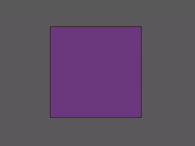

# bevy_ecs_tilemap_tileset

> A mouthful, I know. Working on a better name.

An extension to the wonderful [`bevy_ecs_tilemap`](https://github.com/StarArawn/bevy_ecs_tilemap) crate for Bevy, allowing for configurable tilesets and basic auto tiling capabilities.


## 📋 Features

* Configure tiles via [RON](https://github.com/ron-rs/ron) files
* Generate tilesets that readily work with `bevy_ecs_tilemap`
* Basic auto tiling
* Tile variants
* Smart tile spawning— automatically inserts the necessary components based on the tile config

## ✨ Usage

Simply **define** your tiles in a config file:

```rust
(
	name: "My Tile",
  tile: Standard("textures/my_tile.png")
)
```

And **load** it in via a system:

```rust
use bevy::prelude::*;
use bevy_ecs_tilemap_tileset::prelude::*;

fn load_tiles(mut writer: EventWriter<TilesetLoadEvent>) {
	writer.send(
    TilesetLoadRequest::named(
    	"My Awesome Tileset", 
    	vec![TilesetDirs::from_dir("tiles")],
  	)
    .into()
  );
}
```

Then **access** the generated tileset from anywhere:

```rust
fn my_system(tilesets: Res<Tilesets>, /* other system params */) {
  
  // ...
  
  if let Some(tileset) = tilesets.get_by_name("My Awesome Tileset") {
    tileset.place_tile(
      "My Tile",
      position,
      map_id,
      layer_id,
      &mut commands,
      &mut map_query,
		);
  }
  
  // ...
  
}
```

## Tile Types

Currently there are four main tile types:

### 🖼 Standard

Defines a basic tile.

```rust
// my-tile.ron

(
	name: "My Tile",
  tile: Standard("textures/my_tile.png")
)
```

### 🎞️ Animated

Defines an animated tile that can be generated with the `GPUAnimated` component from `bevy_ecs_tilemap`.

```rust
// my-animated-tile.ron

(
	name: "My Animated Tile",
  tile: Animated((
  	speed: 2.25,
    frames: [
      "textures/animated-001.png",
      "textures/animated-002.png",
      "textures/animated-003.png",
    ]
  ))
)
```

### 🎲 Variant

Defines a tile that has a set of possible variants. A random variant is chosen at random when placed. These variants can either be Standard or Animated.

```rust
// my-variant-tile.ron

(
	name: "My Crazy Random Tile",
  tile: Variant([
    (
    	weight: 1.0,
      tile: Standard("textures/variant-standard-001.png")
    ),
    (
      // Default weight: 1.0
      tile: Standard("textures/variant-standard-002.png")
    ),
    (
    	weight: 0.0001, // Wow that's rare!
      tile: Animated((
      	// Default speed: 1.0
        frames: [
          "textures/variant-animated-001.png",
          "textures/variant-animated-002.png",
          "textures/variant-animated-003.png",
        ]
      ))
    )
  ])
)
```

### 🧠 Auto

Defines a tile that automatically chooses its active tile based on its neighbors. This behavior can be controlled with rules. These sub-tiles are themselves Variant tiles.

```rust
// my-auto-tile.ron

#![enable(implicit_some)]

(
	name: "My Auto Tile",
	tile: Auto([
    (
      rule: (
        north: true,
        east: false,
        west: true,
      ),
      variants: [
        (
        	tile: Standard("textures/n_w-e-001.png")
        ),
        (
          weight: 2.0, 
        	tile: Standard("textures/n_w-e-002.png")
        )
      ]
    ),
    (
      rule: (
        // Also supports short notation
        n: false,
        s: false,
        // And ordinal directions
        south_west: true,
        nw: false
      ),
      variants: [
        (
        	tile: Standard("textures/sw-n_s_nw.png")
        )
      ]
    ),
  ])
)
```



## 🌱 Areas of Growth

There are some things this crate could do better in. Here's a list of potential areas to grow:

- [ ] Tileset
  - [ ] Config files ★
- [ ] Auto Tile
  - [ ] Mirror/Rotation (designate a rule to be mirrored or rotated)
- [ ] Loading
  - [ ] Load configs as assets (to allow for *semi*-hot reloading)

As well as just an overall improved and cleaner API.

## ℹ️ About

This crate was made to serve my purposes for my own tile-based games. I really liked `bevy_ecs_tilemap` but wanted to extend it in a way that might not be a good fit for that crate internally (i.e. muddy their API and create bloat). This is not a perfect library by any means but it gets the job done as best it can— at least for my purposes.

### Publishing

As for publishing, I'm hesitant to publish this as its own crate for a few reasons:

* The idea of this being an extension to an extension of Bevy sounds messy
  * It may cause confusion in the community for those using `bevy_ecs_tilemap`
  * It limits users to this crate's version of `bevy_ecs_tilemap` (more-or-less)
* The API needs a lot of improvement
  * Requesting and listening for the load to complete feels a bit clunky (this should be less of a hassle when tilset config files are added)
  * Removing auto tiles requires placing the logic in a specific `SystemStage` and sending out the `RemoveAutoTileEvent` event (I really hate this but I'm not sure how to resolve it)
* Auto tiling itself can be slow for large amounts of tiles
  * In release, placing a single tile takes around 25–85µs (depending on the number of neighbors)
  * But updating a large amount can take much longer:
    * 100x100 : ~42ms
    * 500x500 : ~1.15s
    * 1000x1000 : ~4.9s
* I can't think of a good name for it :(


However, I'm open to publishing this if people think it's a good idea to do so. **If you think it should be published, feel free to open an issue regarding this!**

## 📲 Installation

While I decide on publishing this crate or not, you can still install it to use or try out via git:

```toml
[dependencies]
bevy_ecs_tilemap_tileset = { git = "https://github.com/MrGVSV/bevy_ecs_tilemap_tileset", tag = "v0.1.0"}
```

